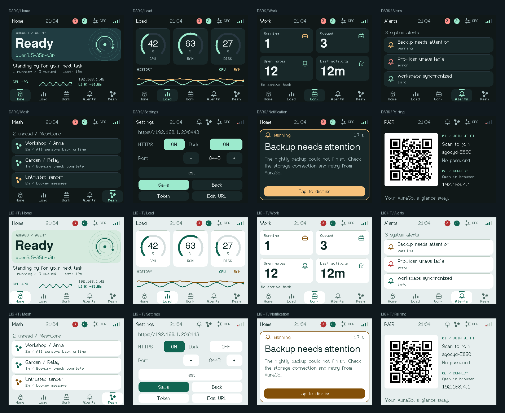

# aurago-cyd

Firmware for the [ESP32 Cheap Yellow Display](https://github.com/witnessmenow/ESP32-Cheap-Yellow-Display)
(ESP32-2432S028R, 320×240 resistive TFT). It is a LAN mini-dashboard for
[AuraGo](https://github.com/antibyte/AuraGo): agent idle/busy, host load, missions,
and agent-pushed notification overlays.



Graphite surfaces, mint accents, bold status and numbers, and custom pixel-aligned
icons. The orbit backdrop is drawn natively; no image assets or extra graphics
dependencies are needed. Each navigation tab has a 64×36-pixel touch target.
Dashboard updates compose 16-bit RGB565 bands in a 25,600-byte pixel buffer before
sending them to the TFT, including notification overlays. Allocation failure falls
back to direct drawing.

Five pages: **Home**, **Load**, **Work**, **Alerts** (system warnings + count bubble), **Mesh** (MeshCore inbox). After 10s without touch the pages rotate every 5s. Incoming notify/mesh/warnings jump immediately. Tap labeled footer tabs, badges, or swipe. Dark mode is the default.

The image above is a host-rendered preview of the actual UI code with example
data and the firmware fonts. Arc edges approximate TFT anti-aliasing; hardware
color, refresh timing, and touch calibration still require a physical display.

## Hardware

| Board | PlatformIO env | Notes |
|---|---|---|
| Single micro-USB CYD | `cyd` (default) | ILI9341_2 |
| Dual USB (micro + USB-C) CYD2USB | `cyd2usb` | ST7789, BGR |

The USB-C port on CYD2USB often lacks CC resistors. Use USB-A to USB-C, not C-to-C.

Install the CH340 driver if the board is not enumerated.

## Flash

Requires [PlatformIO](https://platformio.org/):

```bash
pio run -e cyd -t upload
pio device monitor
```

CYD2USB:

```bash
pio run -e cyd2usb -t upload
```

If upload fails, keep `upload_speed = 115200` (already set) and hold **BOOT** while tapping **RESET**.

## First boot

1. Prefer the **Web flasher** on AuraGo Config → Cheap Yellow Display (Chrome or
   Edge, HTTPS or localhost). It programs the board over USB and writes the
   display token plus Display URL, so the glass only needs Wi-Fi.
2. If you flashed with PlatformIO instead, the display opens a captive portal AP
   named `agocyd-XXXX` and shows a Wi-Fi QR code. Scan it to join (open network,
   no password). Then open `192.168.4.1` if the portal does not appear by itself.
3. On the portal set Wi-Fi SSID / password. After a web-flasher install the
   AuraGo URL and token are already present. Otherwise enter the **Display URL**
   from AuraGo (`https://<lan-ip>:8443` if HTTPS is on) and type the 9-character
   code (`XXX XXX XXX`) on the glass. `aura_` is prefilled. If the host is wrong,
   tap **Edit** on the connecting/offline screen.
4. After connect, swipe (or tap the footer tabs) across Home, Load, Work, Alerts, and Mesh.
5. Tap **CFG** in the header for setup (HTTPS, port, dark mode). Dark mode is the default.
6. Tap an overlay to dismiss it. RGB LED: green idle, yellow busy, red error/critical, blue connecting.
7. Hold **BOOT** for 5 seconds at power-on to wipe config and reopen the portal.

`demo` as the URL runs an offline animated dashboard (no AuraGo required).

AuraGo must listen on a LAN address, not only `127.0.0.1`. Default AuraGo bind is loopback;
set `server.host` (or use Tailscale) so the CYD can reach it.

## Protocol

See [docs/protocol.md](docs/protocol.md). Short version:

| Method | Path | Role |
|---|---|---|
| GET | `/api/cyd/snapshot` | compact dashboard JSON |
| GET | `/api/cyd/ws` | live snapshot + notify |
| POST | `/api/cyd/heartbeat` | firmware / RSSI |
| POST | `/api/cyd/ack` | dismiss overlay |

Auth: `Authorization: Bearer aura_…`. WebSocket may use `?token=`.

Mock host (no AuraGo):

```bash
python scripts/mock_server.py --port 8088 --token aura_dev
python scripts/test_protocol.py
```

Point the CYD URL at `http://<pc-lan-ip>:8088` and token `aura_dev`. Inject an overlay:

```bash
curl -H "Authorization: Bearer aura_dev" -H "Content-Type: application/json" ^
  -d "{\"title\":\"Backup failed\",\"body\":\"disk 98%\",\"priority\":\"critical\"}" ^
  http://127.0.0.1:8088/api/cyd/test
```

## Layout

To check UI layouts without a board, build `cyd` once to fetch the pinned display
libraries, then run `python scripts/preview_ui.py` (C++17 compiler and Pillow).
On Windows it uses Visual Studio C++ Build Tools; on Linux/macOS it uses `c++`.
The script compiles `src/ui.cpp`, checks text bounds and touch targets, compares
buffered and direct output, and writes PNG previews to `.pio/ui-preview/`.
Run the existing regression tests with `python -m unittest discover -s scripts`.

```
include/     public headers
src/         firmware
docs/        wire protocol
examples/    golden snapshot JSON
scripts/     mock server + protocol tests
```

Pins follow the upstream CYD map: TFT on HSPI (12/13/14/15/2/21), touch XPT2046 on
25/32/39/33/36, RGB LED 4/16/17 (active low), LDR 34.

## Agent (AuraGo)

The matching AuraGo integration publishes `/api/cyd/*`, adds `send_notification`
channel `cyd`, and the `cyd_display` tool. This repository is the device side.

## License

MIT. Display pin documentation based on the CYD community project
(witnessmenow/ESP32-Cheap-Yellow-Display, MIT).
